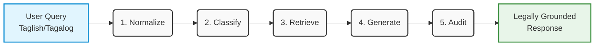

<div align="center">

# ⚖️ Legal Adaptive Routing Framework (LARF)

**An Agentic AI Framework for Processing Philippine-Hong Kong Migrant Workers Legal Queries**

[](https://www.python.org/downloads/)
[](https://openrouter.ai/)
[](docs/DOCUMENTATION.md)

*Saint Louis University | Team 404FoundUs*

[📖 Documentation](docs/DOCUMENTATION.md) • [🐛 Report Bug](issues) • [✨ Request Feature](issues)

</div>

---

## 📖 Overview

The **Legal Adaptive Routing Framework (LARF)** is a specialized Python framework designed to bridge the gap between informal user queries (often in Taglish) and formal legal reasoning. It employs a multi-stage **Agentic Pipeline** to intelligently process, route, and resolve legal queries with high accuracy.

### 🔄 The Agentic Pipeline



1. 🗣️ **Normalize**: Translate linguistic variations (Taglish/Tagalog) into standard legal English.
2. 🧠 **Classify**: Intelligently route queries to the correct domain (e.g., General Information vs. Complex Reasoning).
3. 🔎 **Retrieve**: Advanced RAG (Retrieval-Augmented Generation) search mechanism focused on semantic querying of specific jurisdictional indices (e.g., Philippine and Hong Kong Legal Statutes).
4. 📝 **Generate**: Produce legally grounded responses using specialized LLMs.
5. 🛡️ **Audit**: Validate generated output for safety and minimize hallucinations.

---

## ✨ Features

- **Multi-lingual Support**: Native handling of Tagalog and Taglish inputs.
- **Smart Routing**: Directs queries to the most appropriate legal index or reasoning engine.
- **Modular Architecture**: Built for scalability and easy integration into existing systems.
- **Robust Fact-Checking**: Built-in mechanisms to reduce AI hallucinations in legal contexts.

---

## 🏗️ Project Structure

<details>
<summary><b>Click to expand the directory structure</b></summary>

```text
LegalAdaptiveRoutingFramework/
├── src/
│   └── adaptive_routing/
│       ├── config.py           # Global Configuration
│       ├── core/               # Low-level Engine
│       │   ├── engine.py       # OpenRouter API Handler
│       │   └── exceptions.py   # Custom Errors
│       └── modules/
│           ├── multihead_classifier/   # Triage Components
│           │   ├── detector.py
│           │   └── linguistic.py
│           ├── semantic_router/        # Routing Components
│           │   ├── legal_generation.py
│           │   └── logic_classifier.py
│           ├── legal_retrieval/        # RAG Components
│           │   ├── embedding.py
│           │   └── retriever.py
│           ├── retrieval.py    # Legal Retrieval Facade
│           ├── router.py       # Router Facade
│           └── triage.py       # Triage Facade
├── tests/                      # Unit Tests
├── docs/                       # Documentation
├── main.py                     # CLI Driver Script
├── requirements.txt            # Python Dependencies
└── .env                        # Secrets (Excluded from Git)
```
</details>

---

## ⚡ Quick Start

### 📋 Prerequisites

- **Python**: `3.10` or higher
- **API Key**: [OpenRouter API Key](https://openrouter.ai/) for LLM access

### 💻 Installation

1. **Clone the repository**
   ```bash
   git clone https://github.com/SLU-404FoundUs/Legal-Adaptive-Routing-Framework.git
   cd Legal-Adaptive-Routing-Framework
   ```

2. **Install dependencies**
   ```bash
   pip install -r requirements.txt
   ```

3. **Setup Environment**
   Create a `.env` file in the root directory:
   ```env
   OPENROUTER_API_KEY=your_api_key_here
   # Optional Overrides
   TRIAGE_MODEL=google/gemma-3-4b-it:free
   ```

---

## 🚀 Usage

### Running the Full Pipeline
Run the main driver script to see the pipeline in action:

```bash
python main.py
```

### Exploring Use Cases
To explore different RAG pipelines (from basic retrieval to full multi-index routing), run the included examples:

```bash
python use-cases.py
```

### Using as a Library
You can import the modules directly into your Python application:

```python
from src.adaptive_routing import TriageModule, SemanticRouterModule

# 1. Initialize Modules
triage = TriageModule()
router = SemanticRouterModule()

# 2. Process Input (Taglish -> English)
input_text = "Tinanggal ako sa trabaho ng walang notice."
result = triage._process_request_(input_text)
normalized_text = result['normalized_text'] 
# Output: "I was terminated from my job without notice."

# 3. Route & Generate Legal Response
if normalized_text:
    response = router._process_routing_(normalized_text)
    print(f"Advice: {response['response_text']}")
```

---

## 📚 Documentation

For detailed API references, configuration options, and architectural diagrams, please refer to the **[Full Documentation](docs/DOCUMENTATION.md)**.

---

## 🤝 Contribution

Contributions are welcome! Please ensure that you follow the **Technical Documentation Standards** when adding new modules.

1. Fork the Project
2. Create your Feature Branch (`git checkout -b feature/AmazingFeature`)
3. Commit your Changes (`git commit -m 'Add some AmazingFeature'`)
4. Push to the Branch (`git push origin feature/AmazingFeature`)
5. Open a Pull Request

<div align="center">
  <br/>
  <sub>Built with ❤️ by Team 404FoundUs</sub>
</div>
