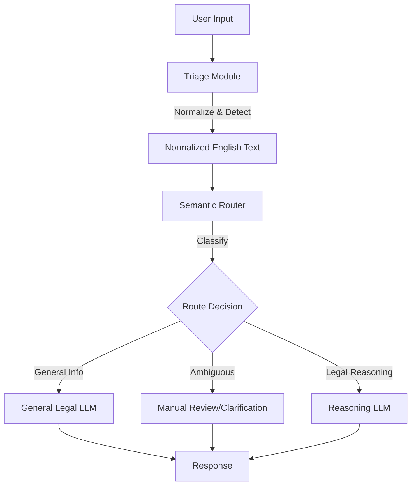

# Legal Adaptive Routing Framework Documentation

## Overview
The **LLM Legal Adaptive Routing Framework** is a specialized system designed to process Philippine legal queries. It employs a multi-stage pipeline powered by OpenRouter LLMs to:
1.  **Normalize** linguistic variations (Taglish/Tagalog to English).
2.  **Detect** language states (Taglish, Tagalog, English).
3.  **Route** queries to the most appropriate processing pathway (General Information vs. Legal Reasoning).
4.  **Generate** legally grounded responses.

## Architecture



## Configuration
The framework is configured via `src/adaptive_routing/config.py`. It prioritizes environment variables (`.env`) but falls back to safe defaults.

### FrameworkConfig
**File**: `src/adaptive_routing/config.py`

| Setting | Module | Default Model | Description |
| :--- | :--- | :--- | :--- |
| **Triage** | Normalization | `google/gemma-3-4b-it:free` | Responsible for translating Taglish/Tagalog to formal English without losing legal context. |
| **Router** | Classification | `default` | Determines if the query needs general info or deep legal reasoning. |
| **General** | Generation | `google/gemma-3-27b-it:free` | Handles standard definition and process questions. |
| **Reasoning** | Generation | `deepseek/deepseek-r1:free` | Handles complex case analysis and application of law. |

---

## Module Reference

### 1. Triage Module
**Import**: `src.adaptive_routing.modules.triage`
**Class**: `TriageModule`

The entry point for all raw user input. It handles the "garbled" nature of informal communication.

#### Key Components
-   **LinguisticNormalizer** (`src/adaptive_routing/modules/multihead_classifier/linguistic.py`):
    -   Uses an LLM to translate input while preserving legal intent.
    -   Extracts detected language tags (e.g., `<Detected Raw Language: Taglish>`).
-   **LanguageStateDetector** (`src/adaptive_routing/modules/multihead_classifier/detector.py`):
    -   Maintains the state of the transformation (Original Text -> Normalized Text).

#### API
```python
def _process_request_(self, input_text: str, image_path: str = None) -> dict:
    """
    Returns:
        {
            "input_text": str,
            "normalized_text": str,
            "detected_language": str,
            "timestamp": datetime
        }
    """
```

### 2. Semantic Router
**Import**: `src.adaptive_routing.modules.router`
**Class**: `SemanticRouterModule`

Decides *how* the query should be answered based on its complexity and intent.

#### Key Components
-   **RoutingClassifier** (`src/adaptive_routing/modules/semantic_router/logic_classifier.py`):
    -   Analyzes the *normalized* text.
    -   Outputs a route: `PATHWAY_1` (General), `PATHWAY_2` (Ambiguous), or `PATHWAY_3` (Reasoning).
-   **LegalGenerator** (`src/adaptive_routing/modules/semantic_router/legal_generation.py`):
    -   Dispatches the prompt to the specific LLM model assigned to the chosen route.

#### API
```python
def _process_routing_(self, normalized_text: str) -> dict:
    """
    Returns:
        {
            "classification": {
                "route": str,
                "confidence": float,
                "reasoning": str
            },
            "response_text": str
        }
    """
```

### 3. Core Engine
**Import**: `src.adaptive_routing.core.engine`
**Class**: `LLMRequestEngine`

The low-level networking layer that communicates with OpenRouter. Handles:
-   Authentication (Bearer Token)
-   Payload construction (Messages, Temperature, Max Tokens)
-   Error handling (Retries, Timeouts)

---

## Directory Structure
The following structure reflects the actual codebase layout:

```text
src/
└── adaptive_routing/
    ├── config.py
    ├── core/
    │   ├── engine.py
    │   └── exceptions.py
    └── modules/
        ├── multihead_classifier/       <-- Triage Components
        │   ├── detector.py
        │   └── linguistic.py
        ├── semantic_router/            <-- Router Components
        │   ├── legal_generation.py
        │   └── logic_classifier.py
        ├── router.py                   <-- Router Facade
        └── triage.py                   <-- Triage Facade
```

