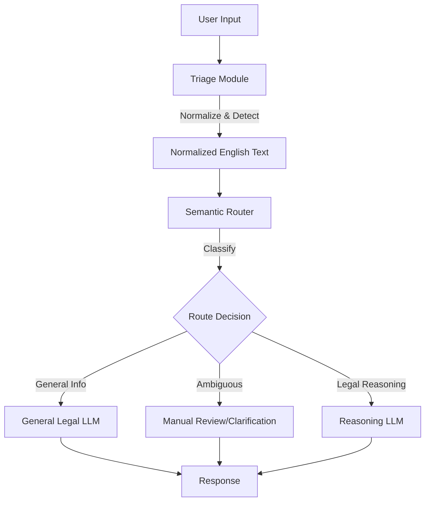

# Legal Adaptive Routing Framework Documentation

## Overview
The **LLM Legal Adaptive Routing Framework** is a specialized system designed to process Philippine legal queries. It employs a multi-stage pipeline powered by OpenRouter LLMs to:
1.  **Normalize** linguistic variations (Taglish/Tagalog to English).
2.  **Detect** language states (Taglish, Tagalog, English).
3.  **Route** queries to the most appropriate processing pathway (General Information vs. Legal Reasoning).
4.  **Generate** legally grounded responses.

## Architecture


```mermaid
graph TD
    UserInput[User Input] --> Triage[Triage Module]
    Triage --> |Normalize & Detect| Normalized[Normalized English Text]
    Normalized --> Router[Semantic Router]
    Router --> |Classify| RouteDecision{Route Decision}
    RouteDecision -->|General Info| Pathway1[General Legal LLM]
    RouteDecision -->|Ambiguous| Pathway2[Manual Review/Clarification]
    RouteDecision -->|Legal Reasoning| Pathway3[Reasoning LLM]
    Pathway1 --> Response
    Pathway2 --> Response
    Pathway3 --> Response
```

## Configuration
The framework is configured via `src/adaptive_routing/config.py`. It prioritizes environment variables (`.env`) but falls back to safe defaults.

### FrameworkConfig
**File**: `src/adaptive_routing/config.py`

| Setting | Module | Default Model | Description |
| :--- | :--- | :--- | :--- |
| **Triage** | Normalization | `google/gemma-3-4b-it:free` | Responsible for translating Taglish/Tagalog to formal English without losing legal context. |
| **Router** | Classification | `default` | Determines if the query needs general info or deep legal reasoning. |
| **General** | Generation | `google/gemma-3-27b-it:free` | Handles standard definition and process questions. |
| **Reasoning** | Generation | `deepseek/deepseek-r1:free` | Handles complex case analysis and application of law. |
| **Retrieval** | RAG Searching | `sentence-transformers/all-minilm-l6-v2` | Responsible for document embeddings and semantic vector search via FAISS. |

---

## Module Reference

### 1. Triage Module
**Import**: `src.adaptive_routing.modules.triage`
**Class**: `TriageModule`

The entry point for all raw user input. It handles the "garbled" nature of informal communication.

#### Key Components
-   **LinguisticNormalizer** (`src/adaptive_routing/modules/multihead_classifier/linguistic.py`):
    -   Uses an LLM to translate input while preserving legal intent.
    -   Extracts detected language tags (e.g., `<Detected Raw Language: Taglish>`).
-   **LanguageStateDetector** (`src/adaptive_routing/modules/multihead_classifier/detector.py`):
    -   Maintains the state of the transformation (Original Text -> Normalized Text).

#### API
```python
def _process_request_(self, input_text: str, image_path: str = None) -> dict:
    """
    Returns:
        {
            "input_text": str,
            "normalized_text": str,
            "detected_language": str,
            "timestamp": datetime
        }
    """
```

### 2. Semantic Router
**Import**: `src.adaptive_routing.modules.router`
**Class**: `SemanticRouterModule`

Decides *how* the query should be answered based on its complexity and intent.

#### Key Components
-   **RoutingClassifier** (`src/adaptive_routing/modules/semantic_router/logic_classifier.py`):
    -   Analyzes the *normalized* text.
    -   Outputs a route: `PATHWAY_1` (General), `PATHWAY_2` (Ambiguous), or `PATHWAY_3` (Reasoning).
-   **LegalGenerator** (`src/adaptive_routing/modules/semantic_router/legal_generation.py`):
    -   Dispatches the prompt to the specific LLM model assigned to the chosen route.

#### API
```python
def _process_routing_(self, normalized_text: str) -> dict:
    """
    Returns:
        {
            "classification": {
                "route": str,
                "confidence": float,
                "reasoning": str
            },
            "response_text": str
        }
    """
```

### 3. Core Engine
**Import**: `src.adaptive_routing.core.engine`
**Class**: `LLMRequestEngine`

The low-level networking layer that communicates with OpenRouter. Handles:
-   Authentication (Bearer Token)
-   Payload construction (Messages, Temperature, Max Tokens)
-   Error handling (Retries, Timeouts)

### 4. Legal Retrieval Module (RAG)
**Import**: `src.adaptive_routing.modules.retrieval`
**Class**: `LegalRetrievalModule`

Facade orchestrator handling the Retrieval-Augmented Generation pipeline. Provides programmatic methods to ingest semantic chunks, persist them in FAISS, and query them seamlessly using standard legal text logic.

#### Key Components
-   **EmbeddingManager** (`src/adaptive_routing/modules/legal_retrieval/embedding.py`):
    -   Handles text chunking, embedding using local or remote models, and stores binary context natively via `faiss`.
-   **LegalRetriever** (`src/adaptive_routing/modules/legal_retrieval/retriever.py`):
    -   Handles specific similarity search parameters and context resolution context limits (`top_k`).

#### API
```python
def _process_retrieval_(self, query: str, top_k: int = None) -> dict:
    """
    Returns:
        {
            "query": str,
            "retrieved_chunks": [
                {"chunk": str}, ...
            ]
        }
    """
```

---

## Directory Structure
The following structure reflects the actual codebase layout:

```text
src/
└── adaptive_routing/
    ├── config.py
    ├── core/
    │   ├── engine.py
    │   └── exceptions.py
    └── modules/
        ├── multihead_classifier/       <-- Triage Components
        │   ├── detector.py
        │   └── linguistic.py
        ├── semantic_router/            <-- Router Components
        │   ├── legal_generation.py
        │   └── logic_classifier.py
        ├── legal_retrieval/            <-- RAG Components
        │   ├── embedding.py
        │   └── retriever.py
        ├── router.py                   <-- Router Facade
        ├── triage.py                   <-- Triage Facade
        └── retrieval.py                <-- Legal Retrieval Facade
```

---

## RAG Usage Guide

The framework ships with an example implementation in `use-cases.py`, covering the three primary ways to leverage the RAG system depending on your architectural complexity constraint.

### 1. Simple Use Case (Pure Retrieval)
The most basic ingestion/retrieval setup to fetch similar legal context strings. It avoids utilizing Generation or Triage pathways.

```python
from src.adaptive_routing import LegalRetrievalModule

retriever = LegalRetrievalModule()

# 1. Provide context texts
docs = ["Rule #1: Tenants must pay rent.", "Rule #2: Leases can be 1-year terms."]
retriever._ingest_documents_(docs)

# 2. Retrieve answers via semantic FAISS
results = retriever._process_retrieval_("What is the penalty for not paying rent?", top_k=2)
# returns "retrieved_chunks"
```

### 2. Intermediate Use Case (Single-Index RAG)
Retrieves semantic chunks directly and manually forwards them to the LLM backend for grounded synthesis—bypassing the `SemanticRouter` triage phase.

```python
from src.adaptive_routing import LegalRetrievalModule
from src.adaptive_routing.modules.semantic_router.legal_generation import LegalGenerator

retriever = LegalRetrievalModule()
generator = LegalGenerator()

# 1. Fetch chunks natively
retrieval_data = retriever._process_retrieval_("Eviction protocols", top_k=3)
chunks = retrieval_data.get("retrieved_chunks", [])

# 2. Re-combine strings logically
context_str = "\n".join([f"- {c['chunk']}" for c in chunks])
augmented_query = f"CONTEXT:\n{context_str}\n\nUSER QUERY:\nEviction protocols"

# 3. Direct response via General-LLM
response = generator._dispatch_(augmented_query, "General-LLM")
```

### 3. Complex Use Case (Multi-Index RAG with Adaptive Routing)
For enterprise multi-jurisdictional use cases (e.g., separating HK law from PH law), representing the full end-to-end framework stack.

1. **User Query Normalization**: `TriageModule` normalizes mixed Taglish into legal English.
2. **Intent Routing**: `RoutingClassifier` defines if it strictly requires Legal Reasoning (`Reasoning-LLM`) or simple procedural questions (`General-LLM`).
3. **Multi-Index Targeting**: The normalized text performs `_process_retrieval_` separately against `hk_index.faiss` and `ph_index.faiss`.
4. **Partitioned Sourcing**: `LegalGenerator` triggers against a concatenated `augmented_query` containing strictly segregated regional laws.

*Refer to `use-cases.py` for the complete `complex_use_case` script snippet tying these architectures together concurrently.*

