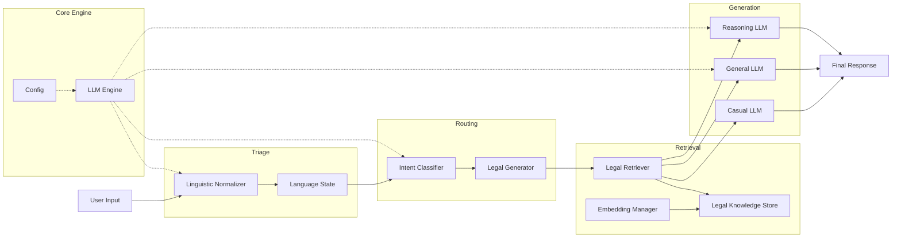

# Legal Adaptive Routing Framework — Documentation

> **Saint Louis University — Team 404FoundUs**  
> **Project**: LLM Legal Adaptive Routing Framework  
> **Purpose**: An AI-powered multi-stage pipeline for processing OFW legal queries across Philippine and Hong Kong jurisdictions.

---

## Overview

The **Legal Adaptive Routing Framework** is a modular system that processes legal queries through three intelligent stages:

1. **Linguistic Normalization** — Converts multilingual input (Tagalog, Taglish, Cantonese, etc.) into standardized legal English.
2. **Semantic Routing** — Classifies queries by intent and generates **Search Signals** (keywords) to guide retrieval.
3. **Legal Retrieval (RAG)** — Performs **Signal-Guided Retrieval** using a Hybrid Search Engine (FAISS + BM25). For follow-up queries, the system intelligently reuses previous legal context.

The framework communicates with LLMs through the **OpenRouter API** and supports scalable multi-step query processing.

---

## Architecture Diagram


```mermaid
flowchart LR
    %% ===== INPUT =====
    User["User Input"]

    %% ===== TRIAGE =====
    subgraph Triage
        LN["Linguistic Normalizer"]
        LD["Language State"]
        LN --> LD
    end

    %% ===== ROUTER =====
    subgraph Routing
        RC["Intent Classifier"]
        LG["Legal Generator"]
        RC --> LG
    end

    %% ===== RETRIEVAL =====
    subgraph Retrieval
        LR["Legal Retriever"]
        EM["Embedding Manager"]
        STORE["Legal Knowledge Store"]
        EM --> STORE
        LR --> STORE
    end

    %% ===== GENERATION =====
    subgraph Generation
        CASUAL["Casual LLM"]
        GEN["General LLM"]
        REAS["Reasoning LLM"]
    end

    %% ===== CORE =====
    subgraph Core Engine
        ENGINE["LLM Engine"]
        CONFIG["Config"]
    end

    %% ===== FLOW =====
    User --> LN
    LD --> RC
    LG --> LR
    LR --> CASUAL
    LR --> GEN
    LR --> REAS

    CASUAL --> Response["Final Response"]
    GEN --> Response
    REAS --> Response

    %% ===== CONTROL FLOW =====
    ENGINE -.-> LN
    ENGINE -.-> RC
    ENGINE -.-> GEN
    ENGINE -.-> REAS
    CONFIG -.-> ENGINE
```

---

## Pipeline Flow

```
User Input (any language)
    │
    ▼
┌──────────────────────────────────────────┐
│  Stage 1: TRIAGE MODULE                  │
│  • LinguisticNormalizer normalizes text   │
│  • LanguageStateDetector stores state     │
│  Output: {normalized_text, language}      │
└──────────────┬───────────────────────────┘
               │
               ▼
┌──────────────────────────────────────────┐
│  Stage 2: SEMANTIC ROUTER MODULE         │
│  • Classification + Signal Generation    │
│  • Routes to General or Reasoning LLM    │
│  Output: {route, confidence, search_signals}│
└──────────────┬───────────────────────────┘
               │
               ▼
┌──────────────────────────────────────────┐
│  Stage 3: LEGAL RETRIEVAL (RAG)          │
│  • Signal-Guided Hybrid Search           │
│  • Context Reuse for Follow-up Queries   │
│    (recycles last_rag_context)           │
│  Output: {retrieved_chunks}              │
└──────────────┬───────────────────────────┘
               │
               ▼
┌──────────────────────────────────────────┐
│  Stage 4: RESPONSE GENERATION            │
│  • General-LLM → Info format             │
│  • Reasoning-LLM → ALAC format           │
│  Output: Grounded legal response         │
└──────────────────────────────────────────┘
```

---

## Quick Start

### 1. Install Dependencies

```bash
pip install -r requirements.txt
```

**Required packages:**
- `requests` — HTTP client for OpenRouter API
- `python-dotenv` — Environment variable management
- `faiss-cpu==1.7.4` — Vector similarity search
- `rank-bm25` — Lexical keyword search (BM25)
- `numpy<2` — Numerical operations

### 2. Set Up Environment

Create a `.env` file at the project root:

```env
OPENROUTER_API_KEY=sk-or-v1-your-api-key-here
```

### 3. Basic Usage

```python
from src.adaptive_routing import TriageModule, SemanticRouterModule, LegalRetrievalModule

# Initialize modules
triage = TriageModule()
router = SemanticRouterModule()

# Process a query through the full pipeline
triage_result = triage._process_request_("Pwede ba akong mag-file ng case?")
normalized = triage_result["normalized_text"]

router_result = router._process_routing_(normalized)
print(router_result["response_text"])
```

---

## Module Documentation

Each module has its own comprehensive documentation with API reference, usage examples, and customization guides:

| # | Module | Documentation | Description |
|:---|:---|:---|:---|
| 1 | **Configuration** | [configuration.md](configuration.md) | `FrameworkConfig` — all settings, env variables, runtime overrides |
| 2 | **Core Engine** | [core_engine.md](core_engine.md) | `LLMRequestEngine` — API interface, multimodal support, exception hierarchy |
| 3 | **Triage Module** | [triage_module.md](triage_module.md) | `TriageModule` — linguistic normalization, language detection, state management |
| 4 | **Semantic Router** | [semantic_router_module.md](semantic_router_module.md) | `SemanticRouterModule` — intent classification, dual-engine generation, contact details routing |
| 5 | **Legal Retrieval (RAG)** | [legal_retrieval_module.md](legal_retrieval_module.md) | `LegalRetrievalModule` — document ingestion, hybrid index (FAISS+BM25), reciprocal rank fusion (RRF) |
| 6 | **Usage Examples** | [USAGE_EXAMPLES.md](USAGE_EXAMPLES.md) | Centralized usage examples across all framework modules |

---

## Directory Structure

```
src/
└── adaptive_routing/
    ├── __init__.py                          # Public exports: TriageModule, SemanticRouterModule,
    │                                        #   LegalRetrievalModule, FrameworkConfig
    ├── config.py                            # Centralized configuration hub
    │                                        #   → docs/configuration.md
    │
    ├── core/                                # Foundation layer
    │   ├── engine.py                        # LLMRequestEngine: OpenRouter API interface
    │   └── exceptions.py                    # Custom exception hierarchy
    │                                        #   → docs/core_engine.md
    │
    └── modules/                             # Feature modules
        │
        ├── triage.py                        # TriageModule (Orchestrator)
        ├── multihead_classifier/            # Triage sub-components
        │   ├── linguistic.py                #   LinguisticNormalizer
        │   └── detector.py                  #   LanguageStateDetector
        │                                    #   → docs/triage_module.md
        │
        ├── router.py                        # SemanticRouterModule (Orchestrator)
        ├── semantic_router/                 # Router sub-components
        │   ├── logic_classifier.py          #   RoutingClassifier
        │   └── legal_generation.py          #   LegalGenerator
        │                                    #   → docs/semantic_router_module.md
        │
        ├── retrieval.py                     # LegalRetrievalModule (Orchestrator)
        └── legal_retrieval/                 # RAG sub-components
            ├── embedding.py                 #   EmbeddingManager (chunking + FAISS)
            ├── retriever.py                 #   LegalRetriever (context search)
            └── utils/                       #   Developer Utilities
                └── legal_indexing.py        #     Indexing/Sync helpers
                                             #   → docs/legal_retrieval_module.md
```

---

## Public API Summary

The framework exports **4 main classes** from `src.adaptive_routing`:

```python
from src.adaptive_routing import (
    TriageModule,           # Stage 1: Linguistic normalization
    SemanticRouterModule,   # Stage 2: Intent classification + generation
    LegalRetrievalModule,   # Stage 3: RAG retrieval
    FrameworkConfig          # Configuration management
)
```

### Key Methods at a Glance

| Module | Method | Purpose |
|:---|:---|:---|
| `TriageModule` | `_process_request_(text, image?)` | Normalize multilingual input → English |
| `SemanticRouterModule` | `_process_routing_(text, threshold?, persistence_level?)` | Classify intent → returns `{route, confidence, search_signals}` |
| `SemanticRouterModule` | `_generate_response_(classification, text, context?, is_follow_up?)` | Generation with follow-up awareness |
| `SemanticRouterModule` | `_generate_conversation_(classification, messages, context?, is_follow_up?)` | Multi-turn generation with follow-up awareness |
| `LegalRetrievalModule` | `_process_retrieval_(query, signals?, top_k?)` | Retrieve legal chunks (supports signal-guided keywords) |
| `LegalRetrievalModule` | `_ingest_documents_(docs)` | Add documents to the vector store |
| `LegalRetrievalModule` | `build_and_save_index(dir, out, prefix)` | Build FAISS index from JSON corpus |
| `LegalRetrievalModule` | `_save_index_(index, chunks)` | Persist index to disk |
| `LegalRetrievalModule` | `_load_index_(index, chunks)` | Load saved index |
| `legal_indexing` | `verify_index_integrity(corpus, chunks)` | Check index sync status |
| `legal_indexing` | `rebuild_index(corpus, out)` | Full index rebuild (DMW/IRRRA support) |
| `FrameworkConfig` | `_update_settings_(**kwargs)` | Runtime configuration override |

---

## Environment Variables Reference

| Variable | Module | Default | Description |
|:---|:---|:---|:---|
| `OPENROUTER_API_KEY` | All | *(required)* | OpenRouter API credential |
| `TRIAGE_MODEL` | Triage | `qwen/qwen-turbo` | Normalization LLM |
| `TRIAGE_TEMP` | Triage | `0.6` | Temperature |
| `TRIAGE_MAX_TOKENS` | Triage | `2000` | Max tokens |
| `ROUTER_MODEL` | Router | `qwen/qwen-turbo` | Classification LLM |
| `ROUTER_TEMP` | Router | `0.1` | Temperature |
| `ROUTER_MAX_TOKENS` | Router | `250` | Max tokens |
| `GENERAL_MODEL` | Generation | `qwen/qwen3-next-80b-a3b-instruct:free` | General info LLM |
| `GENERAL_TEMP` | Generation | `0.5` | Temperature |
| `GENERAL_MAX_TOKENS` | Generation | `2500` | Max tokens |
| `REASONING_MODEL` | Generation | `deepseek/deepseek-chat-v3.1` | Reasoning LLM |
| `REASONING_TEMP` | Generation | `0.7` | Temperature |
| `REASONING_MAX_TOKENS` | Generation | `3000` | Max tokens |
| `CASUAL_MODEL` | Generation | `qwen/qwen-turbo` | Casual / small-talk LLM |
| `CASUAL_TEMP` | Generation | `0.8` | Temperature |
| `CASUAL_MAX_TOKENS` | Generation | `200` | Max tokens |
| `RETRIEVAL_MODEL` | RAG | `sentence-transformers/all-minilm-l6-v2` | Embedding model |
| `RETRIEVAL_TOP_K` | RAG | `5` | Chunks to retrieve |
| `RETRIEVAL_CHUNK_SIZE` | RAG | `5000` | Characters per chunk |
| `RETRIEVAL_INDEX_PATH` | RAG | `None` | Pre-built FAISS index path |
| `RETRIEVAL_CHUNKS_PATH` | RAG | `None` | Pre-built chunks JSON path |

> For the complete configuration reference with all parameters, see [configuration.md](configuration.md).
